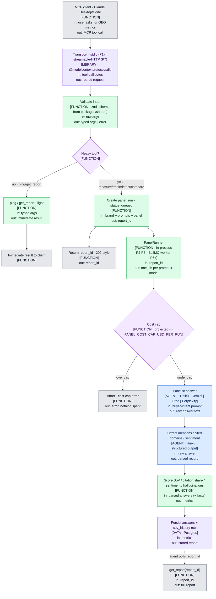

# GEO Radar MCP — Architecture Flow

Honest, granular diagrams of the **real runtime flow**. A person who can't read the code
should be able to debug from these. Update the `.mmd` in the same session as any
structural change — the git diff of the `.mmd` _is_ the change highlight.

- **Built (P1):** stdio transport + `ping`.
- **Built (P2):** `measure_share_of_voice` + `get_report` — in-process `PanelRunner`, Haiku panelist + parser (Vercel AI SDK), deterministic scoring, `DrizzleStore`/`MemoryStore`.
- **Intended — not yet built:** BullMQ queue/worker (P6), streamable-HTTP + OAuth (P7), Gemini/Groq/Perplexity panelists (P5).

Regenerate the standalone viewer: `pnpm diagrams:build` → open `docs/architecture-flow.html`.
Validate syntax: `pnpm diagrams:validate`.

## Legend

| Label | Meaning |
|---|---|
| `[AGENT · <model>]` | an LLM makes the decision/generation |
| `[FUNCTION]` | deterministic code, no model |
| `[LIBRARY · <name>]` | an external library does the work |
| `[DATA · <store>]` | a store/table being read or written |

## Master flow

## Gates at a glance

| Gate | Enforcer | Threshold |
|---|---|---|
| Heavy vs light routing | FUNCTION | tool name ∈ {measure, track, detect, compare} → async |
| Cost cap | FUNCTION | projected run cost ≤ `PANEL_COST_CAP_USD_PER_RUN` |
| report_id validity | FUNCTION | scoped handle with expiry (no hidden session state) |

## File index (stage → file)

| Stage | File |
|---|---|
| Transport / entry (stdio) | `apps/mcp-server/src/index.ts` |
| Env loading + runtime wiring | `apps/mcp-server/src/env.ts` · `runtime.ts` |
| Server factory + tool registration | `apps/mcp-server/src/server.ts` |
| Tools | `apps/mcp-server/src/tools/{ping,measure-share-of-voice,get-report}.ts` |
| Shared Zod schemas | `packages/shared/src/schemas/` |
| Panelist / parser / scoring / cost / runner | `packages/core/src/` |
| Prompt library (built-ins + demo seed) | `packages/core/src/prompt-library.ts` |
| Drizzle schema + stores (Postgres / in-memory) | `packages/db/src/` |
| BullMQ worker | _P6 (not yet built)_ |
